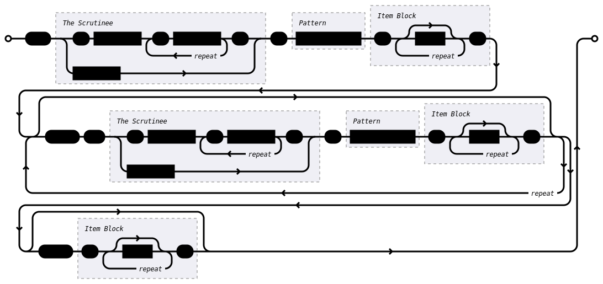
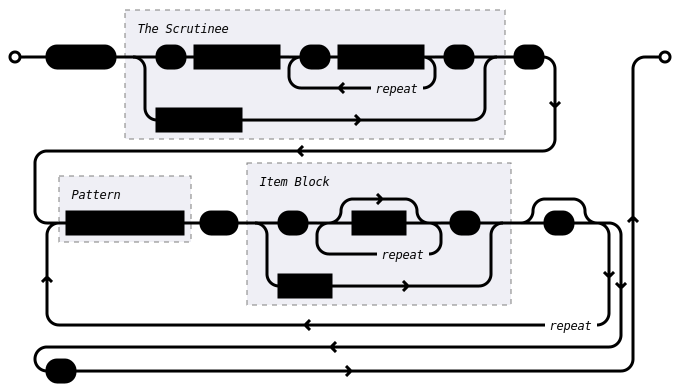

# Conditional Compilation

Zngur provides `#if {} #else if {} #else {}` and `#match` statements to control
which items in you `.zng` file are emitted into the final IDL specification.
These statements are both powered by pattern matching.

**Note:** These statements are an unstable feature, the syntax may change. You need `#unstable(cfg_if)` and `#unstable(cfg_match)` to enable them.

## The Scrutinee

The only scrutinee type currently available is `cfg!(key<.item>)`
which can pull single items or groups of items from a Rust/Cargo configuration key.
See [Rust's documentation on conditional compilation](https://doc.rust-lang.org/reference/conditional-compilation.html)
for details on what keys exist and what their values are.
`cfg!()` is analogous to Rust's own `#[cfg()]` attribute.

If item names contain charters not allowed in a identifier the item can be quoted (i.e. `cfg!(feature."float-values")`).

### Value Sets

To match patterns with value sets use `cfg!(key_name)`. For example `cfg!(target_feature)` will resolve to a
set of features enabled i.e. `("avx", "avx2" "sse")`. If only a single value exists for the key the result will be a single item set
i.e. `cfg!(target_os)` might be `("linux")` or `("windows")`.

### Single Items

To test the presence of a single item in a key you can use dot notation. `cfg!(target_os.linux)` will resolve to a `Some` or `None` value.

## Patterns

The pattern syntax available to match configuration values is diagrammed below.

To summarize:

- Use literals `Some` or `None`, to match the presence of a key.value like `cfg!(target_arch.32 = Some)`.
- Use literals `"string"` (i.e. `"avx"` or `"32"`) or `usize` (i.e. `32` or `64`) to test if the value is present in the set of values returned from a key like `cfg!(target_arch)`.
- Use `!` to negate an expression.
- Use `&` to combine expressions with a logical And.
- Use `|` to combine expressions with a logical Or,
- Use `()` to delimit sub expressions.

<!-- rendered from ./cfg_match_pattern.dia with https://github.com/lukaslueg/railroad_dsl -->
<!-- railroad --theme=dark  cfg_match_pattern.dia -->


## If Statements



### Example

```zng
#unstable(cfg_if)

// test if "foo" is in the `feature` set
#if cfg!(feature."foo") {
    type crate::Foo {
        #layout(size = 1, align = 1);
    }
} #else {
    type crate::Bar {
        #layout(size = 1, align = 1);
    }
}
```

As a special case, leaving out the `= pattern` section of an
`#if` or `#else if` statement is equivalent to writing `= Some`.
The following are equivalent:

```zng
#if cfg!(feature."float-values" = Some) {
  // ...
}

#if cfg!(feature."float-values") {
  // ...
}
```

Yow can combine conditions just like in rust

```zng
#if cfg!(feature.foo) && cfg!(target_pointer_width = 32) {
    type crate::Foo32 {
        #layout(size = 1, align = 1);
    }
} #else if cfg!(feature.foo = None) && cfg!(target_pointer_width = 64) {
    type crate::NoFoo64 {
        #layout(size = 1, align = 1);
    }
} #else if (cfg!(feature.foo = Some) && cfg!(target_pointer_width = 64)) || cfg!(feature.baz) {
    type crate::Foo64_OrBaz {
        #layout(size = 1, align = 1);
    }
} #else {
    type crate::SpecialFoo {
        #layout(size = 1, align = 1);
    }
}
```

## Match Statements



### Example

```zng
#unstable(cfg_match)

#match cfg!(feature) {
    "bar" | "zigza" => type crate::BarZigZa {
        #layout(size = 1, align = 1);
    }
    // match two values from a cfg value as a set 
    "foo" & "baz" => type crate::FooBaz {
        #layout(size = 1, align = 1);
    }
    // negative matching (no feature baz)
    "foo" & !"baz" => type crate::FooNoBaz {
        #layout(size = 1, align = 1);
    }
    _ => {
        type crate::Zoop {
            #layout(size = 1, align = 1);
        }
    }
}
```

### Matching Multiple Values

Tuples can be used to test multiple conditions at once.
i.e.

```
(cfg!(target_pointer_width), cfg!(target_os)) = (64 | 32, "linux")
```

```zng
// match two cfg keys as a set
#match (cfg!(feature.foo), cfg!(target_pointer_width)) {
    (Some, "32") => type crate::Foo32 {
        #layout(size = 1, align = 1);
    }
    (None, 64) => type crate::NoFoo64 {
        #layout(size = 1, align = 1);
    }
    _ => {
        type crate::SpecialFoo {
            #layout(size = 1, align = 1);
        }
    }
}
```
